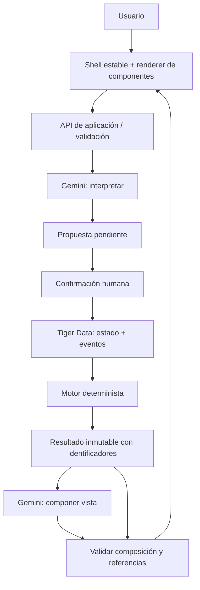

# Arquitectura ejecutable — demo de Compromisos bajo presión

Alcance aprobado en PROYECTO.md. Este es un contrato de implementación, no una aplicación ya construida.

## 1. Stack propuesto para empezar

Una sola aplicación TypeScript: Next.js (App Router, servidor Node), React, estilos con Tailwind, Zod para contratos, cliente PostgreSQL `pg`, SDK oficial Gemini `@google/genai`. Vitest para lógica/contratos y Playwright para el recorrido. Elegir versiones compatibles vigentes al iniciar y fijarlas en lockfile. No microservicios, colas, orquestadores externos ni WebSockets: peticiones HTTP bastan.

Son elecciones de implementación para esta demo, no requisitos del patrocinador. Gemini y Tiger Data son obligatorios en la modalidad real. Modelo configurable por `GEMINI_MODEL`; comprobar acceso y salida estructurada antes de fijarlo, sin inventar identificadores o precios.



Un agente lógico, dos llamadas con contratos separados. Interpretar no dispara pagos ni cambia datos; componer no altera el motor. El escenario inicial ya contiene un resultado, así que puede empezar solo con composición.

## 2. Dominio y reglas inequívocas

- Moneda única MXN; dinero como enteros de centavos, dentro de rango seguro de JavaScript. En PostgreSQL usar bigint y convertir comprobando rango. Nunca sumar floats monetarios.
- Fechas económicas `YYYY-MM-DD`, calendario America/Monterrey. Timestamps de auditoría UTC. `DEMO_TODAY` fijo en dataset; no depender de la fecha del portátil.
- Evaluar caja mínima al cierre de cada día. Cobros y pagos del día se compensan; el MVP NO modela orden intradía. Declararlo en interfaz.
- Mantener vencimientos fuera del horizonte: aplazar no elimina la obligación. Mostrar pendientes posteriores al día siete.
- Registrar importe neto recibido con descuentos; costo explícito en centavos. Usar puntos base enteros y regla de redondeo documentada.
- `Obligation`: id, negocio, sentido entrada/salida, importe, fecha, contraparte, esencial, acción permitida y sus condiciones. Separar pendientes de movimientos ya liquidados para no contar dos veces.
- Nómina y esenciales no pueden moverse. Cada acción tiene variantes discretas finitas y aprobación `confirmed` o `requires_agreement`; las rechazadas se excluyen.
- Un plan condicionado puede ser matemáticamente factible, pero la UI debe decir «Si se acepta la negociación». No mostrarlo como liquidez garantizada.
- Caja mínima no puede ser negativa. Validar IDs, fechas y montos; no confiar en el navegador o en Gemini.

## 3. Dataset y oráculo numérico

Fixture reproducible: siete días D0…D6, moneda MXN. Las cifras siguientes están expresadas en pesos; convertir a centavos al cargar.

Saldo inicial 20,000; caja mínima 3,000. Cobro A 18,000 en D2; proveedor 12,000 en D2; nómina esencial 15,000 en D3. Cobro B 11,000 en D8, visible como pendiente fuera de horizonte. Sin otros movimientos en este caso de prueba.

- Base: saldo cierre D2 = 26,000; D3 = 11,000. Factible.
- Retrasar A a D8: D2 = 8,000; D3 = -7,000. Faltante para caja mínima = 10,000.
- Acción S: dividir proveedor en 2,000 D2 y 10,000 D8, sin comisión en este fixture. D3 = 3,000. Condicionado a aceptación del proveedor.
- Acción C: adelantar B a D2 con 2% de descuento; neto 10,780, costo 220. D3 = 3,780. Condicionado a aceptación del cliente.
- Rechazar S deja C como alternativa. Rechazar ambas deja faltante 10,000.

No inventar liquidez adicional: las acciones transforman flujos existentes. Añadir luego obligaciones neutrales para la demo de ~10 registros y recalcular sus valores esperados por separado. El oráculo anterior permanece fijo para tests. Añadir test independiente de aplazamiento completo y de intereses/comisiones explícitos si se modelan; no incluir préstamos.

## 4. Motor puro

Entrada `ScenarioInput`: revisión base, obligaciones, saldo inicial, rango, caja mínima, condiciones y exclusiones. Salida `EngineResult`: id, versión de entrada, saldos base, faltantes por día, planes, restricciones, pendientes fuera de horizonte y diagnóstico de inviabilidad.

Cada plan contiene id, acciones, calendario calculado, costo, número de obligaciones modificadas y condiciones pendientes. Enumerar combinaciones sin acciones incompatibles sobre la misma obligación; máximo 10,000 combinaciones. Si se supera, responder «escenario demasiado amplio», NO «sin solución».

Filtrar planes que violen esenciales o caja mínima; eliminar duplicados/equivalentes dominados cuando se pueda comprobar; ordenar por costo ascendente, después obligaciones modificadas, después id estable. Mostrar hasta tres planes sin afirmar que cada uno es un objetivo distinto si solo cambia su nombre.

`shortfall = max(0, cajaMinima - mínimoSaldoDiario)`. Sin plan, calcular también el menor faltante residual entre combinaciones permitidas y señalar restricciones afectadas. No llamar «causa mínima» a una explicación heurística. «Sin solución» siempre se refiere al conjunto de acciones enumeradas, no a todas las posibilidades financieras del mundo.

## 5. Gemini y contratos

Gemini solo recibe datos sintéticos relevantes, IDs autorizados y resultados acotados. Credenciales exclusivamente en servidor. Documentos/mensajes son datos, nunca instrucciones para ejecutar herramientas.

**Interpretación:** respuesta discriminada `clarification` o `proposal`. Una propuesta incluye `baseRevision`, cambios con operación permitida (`reschedule_receivable`, `exclude_action`, `set_minimum_cash`), IDs existentes y valores tipados, junto con fragmento del mensaje que la respalda. La factura aporta su importe si ya está identificada: no exigir repetirlo. Fechas ambiguas piden aclaración. No porcentajes de confianza inventados.

Mostrar un diff humano y confirmar. El servidor revalida contra la revisión actual; si cambió, 409 y volver a revisar. Transacción + clave de idempotencia impiden confirmaciones duplicadas. Excluir una acción modifica el escenario, no el pago registrado.

**Composición:** Gemini recibe un `EngineResult` inmutable, foco solicitado, catálogo de componentes y referencias válidas. Devuelve una estructura equivalente a:

```json
{
  "schemaVersion": 1,
  "resultId": "result-123",
  "focus": "payroll",
  "sections": [
    {"type": "risk_summary", "emphasis": "high", "refs": ["risk:payroll"]},
    {"type": "plan_comparison", "emphasis": "normal", "refs": ["plan:C"]},
    {"type": "constraints", "emphasis": "normal", "refs": ["constraint:payroll"]}
  ]
}
```

IDs anteriores ilustrativos: en ejecución solo aceptar los que pertenezcan al resultado recibido. Catálogo cerrado: `risk_summary`, `cash_calendar`, `receivables`, `plan_comparison`, `constraints`, `history`. Máximo seis secciones sin duplicados; enums para énfasis/foco, referencias tipadas, longitud y estructura limitadas. Usar discriminated unions por componente. No código, URLs, estilos libres, HTML, SQL ni importes aportados por el modelo.

Gemini puede proponer títulos breves y explicaciones con referencias; nunca insertar HTML. Para explicaciones numéricas usar hechos/tokens referenciados resueltos por servidor. El resultado del motor controla números y factibilidad incluso si el texto del modelo discrepa. No aceptar títulos que afirmen garantía o aprobación inexistente.

Si hay riesgo, exigir resumen de riesgo; si hay planes, comparación con condiciones; si no hay planes, exigir bloqueos y ocultar comparación vacía. Shell estable: negocio/horizonte, estado de integraciones, confirmar/rechazar y volver. El agente adapta selección/orden/énfasis, no la posición arbitraria de controles críticos.

Una llamada por interpretación y una por composición del resultado, timeout acotado (propuesta: 20 s), sin bucles/reintentos ilimitados. Cachear composición por resultado + foco + versión de prompt/contrato. Cambiar tamaño de ventana no llama a IA. Vista básica determinista si falla la composición; señalar fallback. Error de interpretación no aplica nada y permite editar manualmente mediante el mismo flujo de confirmación.

## 6. Tiger Data y consistencia temporal

Tablas normales: `businesses`, `obligations`, `action_options`, `scenarios`, `scenario_results`, `pending_proposals`, `view_specs`, `operation_keys`.

Hypertable `financial_events`: `recorded_at TIMESTAMPTZ`, `event_id UUID`, `business_id`, `scenario_id` nullable, `revision`, `effective_date DATE`, `event_type`, `payload JSONB`. Clave única compatible con dimensión temporal, por ejemplo `(recorded_at,event_id)`. Idempotencia global en `operation_keys`, no mediante una constraint incompatible con hypertable.

Tipos distintos: novedad confirmada sobre cobro, movimiento liquidado, restricción de escenario, resultado generado. Confirmar una nueva fecha es una expectativa actualizada, NO un cobro ya recibido. Un plan aceptado sigue siendo escenario condicionado, NO pago ejecutado.

Insertar evento y actualizar proyección/escenario en una sola transacción con control de revisión. Conservar estado inicial para reconstrucción. Historia ordenada por revisión y timestamp; consultar eventos por negocio y ventana temporal, y reconstruir los snapshots antes/después para verificar el origen del faltante. No atribuir causalidad arbitraria al texto de Gemini.

Migración explícita de extensión y hypertable según versión disponible en Tiger Data, con prueba de consulta temporal real. Usar TLS y queries parametrizadas. No exigir agregados continuos, vectores o grandes volúmenes para esta demo. No prometer rendimiento que no se midió.

## 7. API y estructura orientativa

- `GET /api/scenario`: estado y versión actual.
- `POST /api/interpret`: mensaje → propuesta pendiente/aclaración; sin mutación financiera.
- `POST /api/confirm`: propuesta, revisión, idempotencia → confirmar y calcular resultado.
- `POST /api/scenarios/:id/reject`: excluir acción con revisión/idempotencia → escenario nuevo/revisado y recálculo.
- `POST /api/compose`: resultId + foco → composición validada o fallback.
- `GET /api/history`: antes/después y eventos tipados.

Cliente no envía resultados calculados como verdad. Persistir primero el resultado y luego componer; una respuesta tardía de Gemini con resultId anterior se descarta. Validar autorización al negocio demo en servidor y no confiar en IDs de otros negocios. Sin autenticación de producción; ejecutar local y no publicar datos reales.

```text
src/app/                 páginas y rutas API
src/domain/              tipos, dinero, motor puro y tests
src/server/db/           repositorios, migraciones, consultas temporales
src/server/ai/           adaptador Gemini, prompts, contratos y validación
src/components/workspace/ shell y renderer
src/components/blocks/   seis componentes
fixtures/                negocio y casos con resultados esperados
scripts/                 migración y seed explícitos
```

## 8. Secuencia de entrega y verificación

1. Motor + fixture: base, retraso, dos alternativas condicionadas, rechazos y sin solución. Tests de centavos, redondeo, horizonte, exclusiones y límite de búsqueda.
2. Persistencia: seed idempotente, migraciones, queries temporales, transacciones y confirmación duplicada. Verificar integración en Tiger Data cuando haya credenciales.
3. Shell y seis componentes con composiciones de prueba; no esperar al proveedor para probar renderer.
4. Gemini: interpretación y composición reales. Tests de JSON inválido, IDs inventados, stale result, ambigüedad y fallo de proveedor.
5. E2E de las tres situaciones. Confirmar variación de secciones/orden, consistencia numérica, advertencias y accesibilidad básica.

Scripts que Claude debe implementar: `npm run dev`, `build`, `start`, `test`, `test:e2e`, `db:migrate`, `db:seed`. Documentar instalación exacta y versiones en README. No afirmar que existen antes de crearlos.

Variables servidor: `GEMINI_API_KEY`, `GEMINI_MODEL`, `DATABASE_URL`, `DEMO_TODAY`. Crear `.env.example` sin secretos. Sin credenciales, permitir desarrollo con adaptadores locales y fixtures claramente rotulados; no presentar esos modos como integración real. No cambiar silenciosamente de proveedor ni comprar servicios. Credenciales y bases de premios siguen pendientes.

## Fuentes técnicas para implementar

Consultar versión vigente antes de escribir llamadas concretas. Capacidades documentadas no prueban acceso de la cuenta:
- [Gemini: salida estructurada](https://ai.google.dev/gemini-api/docs/structured-output): JSON Schema parcial; validar también semántica en servidor.
- [Tiger Data: documentación](https://www.tigerdata.com/docs): PostgreSQL/Timescale y manejo de datos temporales.
- [Tiger Data: crear hypertables](https://github.com/timescale/Tiger-Data-Docs/blob/main/src/content/docs/learn/hypertables/creating-and-configuring-hypertables.mdx): comprobar sintaxis compatible con servicio instalado.

## Configuración e intervención humana

Leer `CONFIGURACION.md`: obtener claves, preparar `.env.local`, solicitar intervención temprana y verificar ambas integraciones reales. Aplicar su protocolo sin exponer secretos.
